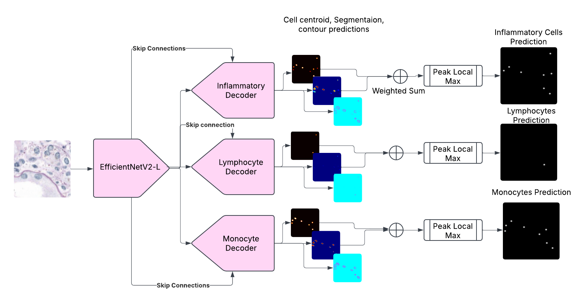

# Monkey_TIAKong
GitHub Repostory for TIAKong Algorithm for the [MONKEY challenge](https://monkey.grand-challenge.org/).  
This algorithm achieved 1st place for overall detection, and 2nd place for detection classification in the challenge.  

# Description
Training and prediction pipeline for mononuclear leukocytes (MNLs) detection.  
Class 1: Overall MNLs  
Class 2: Lymphocytes  
Class 3: Monocytes

# Model
Multi-head Model consisting of an EfficientNetV2_L encoder pretrained on ImageNet and 3 decoders each specialised in detecting one class of cells.  
Each decoder outputs three maps: Cell Centroids, cell Segmentation, and cell contours map.  


# Training
Training script: `train_multiclass_detection.py`  
## Data Preparation  
Extract patches of size 256x256 px at 40x power from Monkey Dataset.  
For each patch, there are 3 ground truth masks:  
- **Nuclei centroid mask**: nuclei Centroids are dilated with a diameter of 11 px.  
- **Nuclei segmentation mask**: use the publicly available `NuClick` (PanNuke) model from [TIAToolBox](https://github.com/TissueImageAnalytics/tiatoolbox) to perform interactive nuclei segmentation to obtain nuclei segmentation masks for each patch.  
- **Nuclei contour mask**: apply Sobel filters on nuclei segmentation masks to obtain nuclei contour masks.

## Loss Functions
Centroid prediction: Jaccard + Dice + Focal  
Segmentation prediction: BCE + Dice  
Contour prediction: BCE + Dice  
Loss from 3 decoders are combined using `AutomaticWeightedLoss` [src](https://github.com/Mikoto10032/AutomaticWeightedLoss).

# WSI Inference Pipeline  
`inference-docker/inference_multiclass_detection.py`  
## Inference Process  
<ol>
<li>Extract 2048x2048px tiles from WSI at 40x power within the ROI
<li>For each tile, extract 256x256px patches with a stride of 224px. Predict on each patch. 
<li> Merge patch predictions, resolve overlaps by averaging. 
<li> Convert centroids prediction maps to coordinates using peak local max with a threshold of 0.5. Repeat for all tiles
<li> Perform non-maximum suppression 
</ol>
  
# Model CheckPoints
We trained the model using a 5-fold cross validation stratified by centres.  
Top 3 model check points can be downloaded [here](https://livewarwickac-my.sharepoint.com/:f:/g/personal/u1910100_live_warwick_ac_uk/Es70doVr9xhPnhGEhMlzWjIB69OqwhpBxO9cfGfpn3TS9g?e=8I4dp6) under CC BY-NC 4.0 license.

# Authors
This repository is made by Jiaqi Lv, from the Tissue Image Analytics Centre, University of Warwick, Coventry, UK.  
Other members of the TIAKong team are: Esha Nasir, Kesi Xu, Mostafa Jahanifar, Brinder Singh Chohan, Behnaz Elhaminia, Shan E Ahmed Raza.  

# Citing
We are currently working on the paper associated with this model, for now you can cite this GitHub repository.
````
@misc{
    Author = {Jiaqi Lv, Esha Nasir, Kesi Xu, Mostafa Jahanifar, Brinder Singh Chohan, Behnaz Elhaminia, Shan E Ahmed Raza},
    Title = {Monkey_TIAKong},
    Year = {2025},
    Publisher = {Github},
    Journal = {GitHub repository},
    Howpublished = {\url{https://github.com/Jiaqi-Lv/Monkey_TIAKong}}
}
````